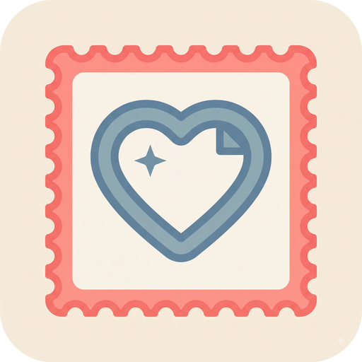

# 📮 MemoStamp - Vintage Memory & Postage Stamp Ecosystem

<p align="center">
  
</p>

<p align="center">
  <strong>Intimate Memory Sharing & Vintage Postage Stamp Collection App</strong><br>
  Built with Kotlin Multiplatform (KMP), Jetpack Compose, SwiftUI & Supabase Cloud Engine
</p>

<p align="center">
  <a href="#"></a>
  <a href="#"></a>
  <a href="#"></a>
  <a href="#"></a>
  <a href="#"></a>
</p>

---

## 🌟 Key Highlights

**MemoStamp** reimagines personal memory sharing by turning everyday moments into authentic **vintage die-cut postage stamps**. Designed for close friends and circles, MemoStamp blends nostalgic physical aesthetic with modern real-time cloud synchronization.

- 📮 **Die-Cut Stamp Press Engine**: Turn photos into vintage postage stamps with authentic perforated edges (`Classic`, `Vintage 35mm`, `Royal Gold`, `Heart`, `Postmark`).
- 🎞️ **35mm Analog Film Filters**: Real-time vintage camera processing with exposure, contrast, grain, and vignette controls.
- 💌 **Intimate Memory Feed**: Share memories exclusively with close friends. Double-tap to like, leave comments, or send mini **Stamp Replies** directly onto posts.
- 🔄 **Peer-to-Peer Stamp Trade System**: Request, exchange, and trade rare memory stamps with friends to complete your personal passport collection.
- 📜 **Passport Profile & Real-Time Stats**: Dynamic profile displaying non-mocked user metrics (stamps created, friends connected, collections unlocked) and achievement badges.
- ☁️ **Offline-First & Cloud Sync**: Seamless local persistence powered by **Room DB** on Android & KMP engine, automatically synchronizing with **Supabase Cloud Database**.

---

## 📸 Core Features & User Journey

### 1. Vintage Stamp Press & Camera
- **Perforated Edge Rendering**: Pixel-perfect die-cut mask algorithms creating real postage stamp shapes.
- **Custom Postmark Inscription**: Inscribe location names, dates, and memory notes directly onto the stamp face.
- **Postcard Backing Flip**: Flip stamps to reveal handwritten notes and postmark stamps on the back.

### 2. Intimate Social Feed & Interactions
- **Double-Tap Heart Reactions**: Quick double-tap gesture triggering custom animated stamp hearts.
- **Stamp Replies (`📮 Reply`)**: Respond to friends' posts with custom-crafted mini stamps.
- **Circle Privacy Controls**: Share posts publicly to all friends or restrict to intimate circles (*Best Friends*, *Travel Crew*).

### 3. Stamp Trading & Passport Vault
- **Stamp Trade Offers**: Propose 1-on-1 stamp trades with friends.
- **Collection Albums**: Organize stamps into thematic series (*Travel & Places*, *Coffee & Food*, *Special Milestones*).
- **Passport Badges**: Automatically unlock explorer and crafter badges as your memory collection grows.

---

## 🛠️ Architecture & Technology Stack

```
           +--------------------------------------------------+
           |           MEMOSTAMP MULTIPLATFORM ECOSYSTEM      |
           +-------------------------+------------------------+
                                     |
              +----------------------+----------------------+
              |                                             |
   +----------v----------+                       +----------v----------+
   |   Android App       |                       |   iOS App           |
   | (Jetpack Compose)   |                       |  (SwiftUI)          |
   +----------+----------+                       +----------+----------+
              |                                             |
              +----------------------+----------------------+
                                     |
                         +-----------v-----------+
                         | KMP Shared Module     |
                         | (Domain / Models /    |
                         |  Shared Repository)   |
                         +-----------+-----------+
                                     |
              +----------------------+----------------------+
              |                                             |
   +----------v----------+                       +----------v----------+
   |  Local Persistence  |                       | Supabase Cloud DB   |
   |  (Room DB / KMP)    |                       | (PostgreSQL Sync)   |
   +---------------------+                       +---------------------+
```

| Layer | Technology | Description |
|---|---|---|
| **Android UI** | Jetpack Compose + Material 3 | Modern declarative UI, custom Canvas stamp geometry, Coil image loading |
| **iOS UI** | SwiftUI | Native iOS presentation with custom view components & SwiftUI state binding |
| **Shared Engine** | Kotlin Multiplatform (KMP) | Unified domain models, coroutines state flows, and cross-platform repositories |
| **Local Database** | Android Room DB + KSP | Offline-first persistence for stamps, collections, and chat logs |
| **Cloud Backend** | Supabase (PostgreSQL / Auth) | Real-time database sync, user authentication, and media storage |
| **Build & CI/CD** | Gradle 8.7 + Codemagic | Automated Xcode archiving and Android APK/AAB generation |

---

## 🚀 Building & Running the Project

### Prerequisites
- **Android Studio** Ladybug (2024.2+) or IntelliJ IDEA
- **JDK 21** (Eclipse Adoptium 21 recommended)
- **Android SDK** (API 36 / Android 15 ready)
- **Xcode 15+** (for building iOS app on macOS)

### 1. Clone Repository
```bash
git clone https://github.com/DINHTANPHATDEVTOOL/MemoStame.git
cd MemoStame
```

### 2. Configure Environment Variables
Create a `.env` file in the root directory:
```env
GEMINI_API_KEY=your_gemini_api_key
GOOGLE_MAPS_API_KEY=your_google_maps_api_key
```

### 3. Build & Run Android App
```bash
export JAVA_HOME=/path/to/jdk-21
export ANDROID_HOME=/path/to/android-sdk

# Build Debug APK
./gradlew :app:assembleDebug

# Run Unit Tests
./gradlew :app:testDebugUnitTest
```
The output APK file will be located at: `app/build/outputs/apk/debug/app-debug.apk`.

### 4. Build iOS App (macOS)
Open `iosApp/iosApp.xcodeproj` in Xcode or run the Codemagic build script:
```bash
xcodebuild archive \
  -project "iosApp/iosApp.xcodeproj" \
  -scheme "iosApp" \
  -destination "generic/platform=iOS" \
  -archivePath build/ios/xcarchive/iosApp.xcarchive \
  CODE_SIGNING_ALLOWED=NO CODE_SIGNING_REQUIRED=NO
```

---

## 📁 Repository Project Structure

```
MemoStame/
├── app/                        # Android Application Module
│   ├── src/main/java/          # Jetpack Compose UI Screens & ViewModels
│   │   └── com/mipastudio/memostamp/
│   │       ├── core/           # Theme, Image Processors & Notification Engine
│   │       ├── data/           # Room DB Entities, DAOs & Cloud Sync Engine
│   │       ├── feature/        # Auth, Feed, Camera, Friends, Passport, Vault
│   │       └── navigation/     # Jetpack Navigation Graph
│   └── src/test/               # Comprehensive Unit Test Suite
├── shared/                     # KMP Shared Kotlin Framework
│   └── src/commonMain/kotlin/  # Shared Domain Models & Shared Memo Stamp Repository
├── iosApp/                     # iOS SwiftUI Application
│   ├── iosApp/                 # SwiftUI Views (HomeScreen, PassportView, CameraView...)
│   └── iosApp.xcodeproj/       # Xcode Project Configuration
├── codemagic.yaml              # Codemagic CI/CD Build Pipeline Configuration
└── README.md                   # Project Documentation
```

---

## 🛡️ License & Author

Copyright © 2026 **MemoStamp Studio**. All rights reserved.

Designed & Developed with ❤️ by **[DINHTANPHATDEVTOOL](https://github.com/DINHTANPHATDEVTOOL)**.
